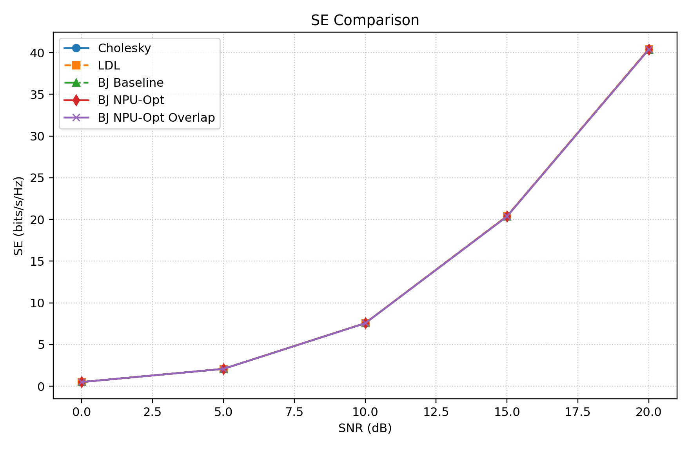
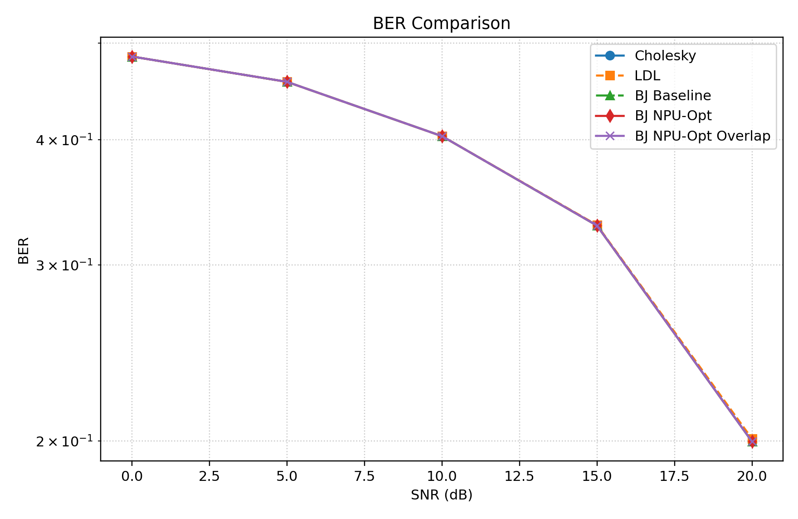
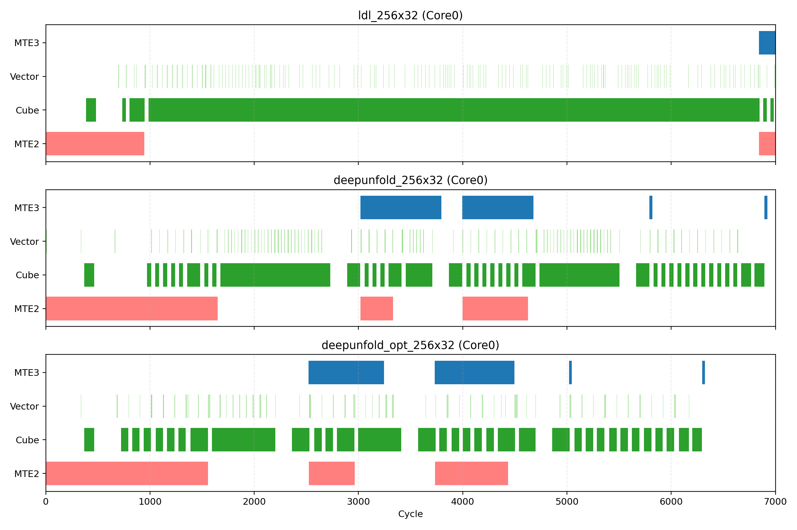

# 深度展开（DeepUnfold）原理、优化与对比报告

## 1. 目标与实验口径
- 目标：说明深度展开原理、已做优化、与 LDL/Cholesky 对比，并给出可复现周期统计。
- 统一口径：`M=256, K=32, batch=96`，同一 `ascend_910b_quiet` 配置。
- 对比方法：`ldl_256x32`、`deepunfold_256x32`、`deepunfold_opt_256x32`、`cholesky_256x32`。
- trace 路径：`results/compare_aligned/*_trace.csv`。

## 2. 深度展开原理（工程化视角）
深度展开把“迭代求解”映射为固定层数的算子流水：

$$X_{k+1}=\mathcal{F}(X_k;A,\mathrm{Reg}),\quad k=0,1,\dots,L-1$$

- 先构造正则化系统矩阵：$A=H^H H + \mathrm{Reg}$。
- 再做固定层数迭代更新，最后计算检测输出（如 $\hat{X}$）。
- 在 NPU 上对应为：`MTE` 搬运 + `Cube(GEMM_PRELOAD)` + `Vector(ADD)` 的交替执行。

### 2.1 优化方法原理（为什么在 NPU 上能加速）
本次优化不是改算法公式，而是改“数据在哪里、什么时候动、同步何时发生”。NPU 上的收益本质来自三点：

1) **减少片外访存（降低 MTE 压力）**
- 去掉外部 `X0` 搬运、改为片上初始化，减少一次完整输入路径。
- `Z`/中间量跨迭代常驻片上，减少迭代间反复 `MOVIN/MOVOUT`。
- 原理：片外带宽和访存启动开销通常高于片上重用，减少搬运量即可直接减少长尾等待。

2) **缩短指令链（降低调度与向量开销）**
- 把 `DUO_VEC_CORR + DUO_VEC_MERGE` 合并为 `DUO_VEC_UPDATE_Z`。
- 原理：减少指令条目、队列排队和依赖边，向量流水更短，给 Cube/MTE 重叠留出空间。

3) **裁剪不必要同步（提高并行重叠）**
- 仅在确有后续组时插入 `group_sync` barrier。
- 原理：barrier 会强制“快单元等慢单元”，删掉冗余屏障可提升跨核、跨执行单元重叠度。

可用统一视角理解：
$$
T_{wall}\approx \max\{T_{MTE},T_{Cube},T_{Vector}\}+T_{sync}+T_{idle}
$$
优化动作分别作用于 $T_{MTE}$、$T_{sync}$ 和 $T_{idle}$，因此在 NPU 上体现为端到端周期下降。

### 2.2 从 MMSE 目标函数推导到表中 `Gram/正则` 公式

对每个子载波/批次，先写出带 $\ell_2$ 正则的检测目标：

$$
\min_X\;\|Y-HX\|_F^2 + \lambda\|X\|_F^2
$$

对 $X$ 求导并令梯度为零：

$$
\nabla_X=2H^H(HX-Y)+2\lambda X=0
$$

得到正规方程：

$$
(H^H H + \lambda I)X = H^H Y
$$

定义

$$
A\triangleq H^H H + \lambda I,
\quad B\triangleq H^H Y
$$

则理想解是

$$
X^*=A^{-1}B
$$

这正对应步骤表里的前两行：
- `Gram矩阵构建`：$A_g=H^H H$
- `对角正则`：$A=A_g+\lambda I$

### 2.3 从显式求逆到深度展开迭代

直接求 $A^{-1}$ 在硬件上代价高，展开法把“求逆”改写成固定层数迭代。定义逆矩阵迭代变量 $X_k\approx A^{-1}$，令

$$
R_k \triangleq AX_k
$$

当 $R_k\to I$ 时，$X_k\to A^{-1}$。因此可构造“残差-校正”两步：

$$
E_k \triangleq I-R_k,
\qquad Z_k \triangleq \phi_k(E_k)
$$

再做更新：

$$
X_{k+1}=\psi_k(X_k,Z_k)
$$

为方便硬件实现，常用线性/仿射近似：

$$
Z_k \approx \alpha_k E_k + \beta_k I,
\qquad
X_{k+1} \approx X_k + X_k Z_k
$$

其中 $\alpha_k,\beta_k$ 可看作“可学习层参数”或固定超参。报告表里的
- `AX乘法阶段`：$R_k=AX_k$
- `残差/校正更新`：$Z_k=\phi_k(R_k, I)$
- `X迭代更新`：$X_{k+1}=\psi_k(X_k,Z_k)$

就是这组公式在 NPU 指令级上的展开。

### 2.4 表中 `W` 与 `\hat X` 公式推导

由正规方程可得线性检测器：

$$
W^* = A^{-1}H^H
$$

当迭代收敛到 $X_L\approx A^{-1}$ 时：

$$
W \approx X_L H^H
$$

最终输出写成：

$$
\hat X = W Y
$$

这与步骤表中：
- `权重矩阵构建W`：$W=f(A,H)$（实现上对应 $X_LH^H$ 近似）
- `输出重建Xhat`：$\hat X=WY$

一一对应。

### 2.5 与当前实现（DU/DUO 指令）的一一映射

结合 `DeepUnfoldNPUOp.cc` / `DeepUnfoldNPUOptOp.cc`：

- `DU_GRAM/DUO_GRAM`：实现 $H^HH$
- `DU_REG/DUO_REG`：实现 $A\leftarrow A+\lambda I$
- `DU_AX_*/DUO_AX_*`：实现 $R_k=AX_k$
- `DU_RES_*` 或 `DUO_VEC_UPDATE_Z_*`：实现 $Z_k=\phi_k(\cdot)$ 的向量校正
- `DU_XNEXT_*/DUO_XNEXT_*`：实现 $X_{k+1}=\psi_k(X_k,Z_k)$ 的矩阵更新
- `DU_W/DUO_W`：实现 $W\approx X_LH^H$
- `DU_XHAT/DUO_XHAT`：实现 $\hat X=WY$

因此，步骤表不是“拍脑袋命名”，而是从目标函数到指令图可追溯的数学-实现映射。

### 2.6 收敛与层数的工程解释

若存在合适初值使谱半径条件满足（如 $\rho(I-AX_0)<1$），则迭代可收敛到 $A^{-1}$ 邻域。工程上不追求无限迭代，而是固定层数 $L$：

$$
X_0 \rightarrow X_1 \rightarrow \cdots \rightarrow X_L
$$

`DeepUnfold-Opt` 的目标不是改变上述数学目标，而是让相同层数下的执行更高效（更少搬运、更少同步、更短向量链）。这也是“算法等价、调度优化”的根本依据。

## 3. 本次有效优化方法
当前保留且验证有效的优化（已回滚掉负收益版本）：
- 去掉外部 `X0` 搬运，改为片上初始化 `Xk`。
- 引入 `Z`/中间量跨迭代片上常驻，避免迭代间额外读写。
- 向量阶段合并：将 `DUO_VEC_CORR + DUO_VEC_MERGE` 合并为单次 `DUO_VEC_UPDATE_Z`。
- 去掉末组冗余 `group_sync` barrier（仅在后续还有组时插入）。

> 说明：尝试过 `H/Y` 分块重叠版本，但总周期变差（依赖链更长），已按结果回退。

## 4.1 四方法真实总周期与并行重叠效率（延迟口径）

| case | wall_cycles | work_cycles_sum | overlap_factor_sum_div_wall | wall_speed_vs_ldl |
|---|---|---|---|---|
| deepunfold_opt_256x32 | 6,370 | 29,321,742 | 4603.10 | 0.457 |
| deepunfold_256x32 | 6,921 | 30,398,792 | 4392.25 | 0.496 |
| ldl_256x32 | 13,953 | 12,487,766 | 894.99 | 1.000 |
| cholesky_256x32 | 102,419 | 13,207,316 | 128.95 | 7.340 |

表4.1结论（端到端周期）：
- 在当前实现和配置下，`deepunfold`/`deepunfold_opt` 的**真实总周期低于 LDL**。
- 关键原因不是“工作量更少”，而是 `deepunfold` 的跨核与跨单元并行重叠更强（`overlap_factor` 更高）。
- 因此，比较方法优劣时必须区分两种口径：`sum(dur)` 看工作量，`wall_cycles` 看真实延迟。

## 4.2 DeepUnfold 分步骤周期表（类比 LDL 表格制作方法）

统计方法与 LDL 报告一致：
- 数据源：`results/compare_aligned/deepunfold_256x32_trace.csv` 与 `deepunfold_opt_256x32_trace.csv`
- 周期定义：`dur = end_cycle - start_cycle`
- 单元映射：`MTE2/MTE3 -> 搬运`，`Cube -> CUBE`，`Vector -> VECTOR`
- 步骤映射：按 `name` 前缀聚类（如 `DU_AX_*`、`DU_XNEXT_*`、`DUO_VEC_UPDATE_Z_*`）

### 4.2.1 DeepUnfold（优化前）分步骤周期表

Trace：`deepunfold_256x32_trace.csv`，`span=6921` cycles。

| 步骤 | 公式 | 搬运周期 | CUBE周期 | VECTOR周期 | 总周期 | 事件数 |
|---|---|---:|---:|---:|---:|---:|
| 搬运(Load/Store) | $H/Y/X$ 与外存交换 | 30,267,944 | 0 | 0 | 30,267,944 | 58,368 |
| Gram矩阵构建 | $A=H^H H$ | 0 | 9,120 | 192 | 9,312 | 288 |
| 对角正则 | $A\leftarrow A+\lambda I$ | 0 | 0 | 384 | 384 | 96 |
| 权重矩阵构建 $W$ | $W=f(A,H)$ | 0 | 9,120 | 0 | 9,120 | 96 |
| AX乘法阶段 | $r_k=A X_k$ | 0 | 44,928 | 0 | 44,928 | 1,152 |
| 残差/校正更新 | $z_k=\phi(r_k,\cdots)$ | 0 | 0 | 4,608 | 4,608 | 1,152 |
| X迭代更新 | $X_{k+1}=\psi(X_k,z_k)$ | 0 | 44,928 | 0 | 44,928 | 1,152 |
| 输出重建 | $\hat X=\operatorname{head}(X_L)$ | 0 | 9,120 | 192 | 9,312 | 288 |
| 中间状态回写 | $X_k/Z_k$ 片上状态维护 | 0 | 0 | 4,608 | 4,608 | 1,152 |
| 同步屏障(Barrier) | 分组/阶段依赖同步 | 0 | 0 | 3,648 | 3,648 | 3,648 |

### 4.2.2 DeepUnfold-Opt（优化后）分步骤周期表

Trace：`deepunfold_opt_256x32_trace.csv`，`span=6370` cycles。

| 步骤 | 公式 | 搬运周期 | CUBE周期 | VECTOR周期 | 总周期 | 事件数 |
|---|---|---:|---:|---:|---:|---:|
| 搬运(Load/Store) | $H/Y/X$ 与外存交换 | 29,195,790 | 0 | 0 | 29,195,790 | 55,296 |
| Gram矩阵构建 | $A=H^H H$ | 0 | 9,120 | 192 | 9,312 | 288 |
| 对角正则 | $A\leftarrow A+\lambda I$ | 0 | 0 | 384 | 384 | 96 |
| 权重矩阵构建 $W$ | $W=f(A,H)$ | 0 | 9,120 | 0 | 9,120 | 96 |
| 初值初始化 | $X_0\leftarrow \text{on-chip init}$ | 0 | 0 | 384 | 384 | 96 |
| AX乘法阶段 | $r_k=A X_k$ | 0 | 44,928 | 0 | 44,928 | 1,152 |
| 残差/校正更新 | $z_k=\phi(r_k,\cdots)$ | 0 | 0 | 1,536 | 1,536 | 384 |
| X迭代更新 | $X_{k+1}=\psi(X_k,z_k)$ | 0 | 44,928 | 0 | 44,928 | 1,152 |
| 输出重建 | $\hat X=\operatorname{head}(X_L)$ | 0 | 9,120 | 192 | 9,312 | 288 |
| 中间状态回写 | $Z_k$ 常驻/回写维护 | 0 | 0 | 4,608 | 4,608 | 1,152 |
| 同步屏障(Barrier) | 分组/阶段依赖同步 | 0 | 0 | 1,440 | 1,440 | 1,440 |

### 4.2.3 为什么 DeepUnfold 表里 Load/Store 特别高？

- 该模型在当前实现下属于**搬运主导型流水**，`MTE` 占比接近 `99.57%`（见表4）。
- `DU/DUO` 迭代链需要反复拉取/回写块数据，CUBE 计算片段相对短，因此累计 `sum(dur)` 中搬运绝对占优。
- 若某些时序图里看到 Cube 段更“长”，通常是**局部时间窗视觉效应**：连续 Cube 条带更显眼，而离散 MTE 小段在图上不明显。

## 4.3 LDL 与深度展开对比、以及优化前后对比

### 4.3.1 LDL vs DeepUnfold（aligned: `M=256,K=32,batch=96`）

来源：`results/compare_aligned/four_method_cycle_summary.csv` 与 `four_method_wallclock_vs_work.csv`。

| 指标 | LDL | DeepUnfold | DeepUnfold-Opt |
|---|---:|---:|---:|
| Wall 周期 | 13,953 | 6,921 | **6,370** |
| Work 周期和（`sum(dur)`） | 12,487,766 | 30,398,792 | 29,321,742 |
| MTE 总周期 | 11,912,438 | 30,267,944 | 29,195,790 |
| Cube 周期 | 550,848 | 117,216 | 117,216 |
| Vector 周期 | 24,480 | 13,632 | 8,736 |
| MTE 占比 | 95.39% | 99.57% | 99.57% |

补充（Scheme B，纳入 `CubeWait` 等待周期，来源：`results/LDL/*_trace_schemeB.csv`）：

| 指标 | LDL | DeepUnfold | DeepUnfold-Opt | Cholesky |
|---|---:|---:|---:|---:|
| Cube计算周期 | 550,848 | 117,216 | 117,216 | 4,562,112 |
| Cube等待周期（CubeWait） | 120,167 | 85,937 | 173,016 | 24,679,818 |
| Cube计算占比（`计算/(计算+等待)`） | **82.0918%** | 57.6984% | 40.3870% | 15.6013% |
| Cube计算事件占比（`events`） | 74.3855% | 50.1354% | 50.0966% | 50.7075% |

结论：
- 端到端延迟上，DeepUnfold 系列快于 LDL；
- 但累计工作量上，DeepUnfold 系列高于 LDL，且更受 MTE 主导；
- 若把 `CubeWait` 纳入考量，LDL 的 Cube 有效计算占比最高（82.09%），DeepUnfold 次之，Cholesky 最低；
- 其优势主要来自并行重叠，不是总工作量更小。

口径说明：`CubeWait` 统计规则为 `name == "CubeWait"` 或 `unit` 后缀为 `_Wait`，计算规则为 `unit` 后缀为 `_Cube` 且 `name != "CubeWait"`。

### 4.3.2 DeepUnfold 优化前后对比（DeepUnfold vs DeepUnfold-Opt）

| 指标 | 优化前 DeepUnfold | 优化后 DeepUnfold-Opt | 变化 |
|---|---:|---:|---:|
| Wall 周期 | 6,921 | **6,370** | **-7.96%** |
| Work 周期和（`sum(dur)`） | 30,398,792 | 29,321,742 | -3.54% |
| MTE 总周期 | 30,267,944 | 29,195,790 | -3.54% |
| Cube 周期 | 117,216 | 117,216 | 0.00% |
| Vector 周期 | 13,632 | 8,736 | -35.92% |

结论：优化收益主要来自向量链条合并与依赖收敛；Cube 工作量基本不变，但 Wall 周期明显下降。

